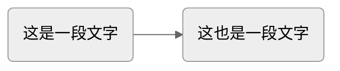

# 基础语法

时间：`2025年10月10日`

快速查看语法用的笔记，请打开Markdown Preview Enhanced使用

---

## 标题

# 标题1

## 标题2

### 标题3

#### 标题4

##### 标题5

###### 标题6

---

## 基础元素

*斜体*
**加粗**
***粗斜体***
`<u>`下划线需要使用html的标签`</u>`：<u>这是下划线</u>
~~删除线~~：`~~内容~~`

~下标~使用波浪号
^上标^使用hat
==高亮==使用两个等号


横线：三个及以上的 -或*，记得前面空行，也可以直接用html的hr

```markdown
    ---
    ***
    <hr>
```

还能使用表情，格式为：`:表情名称:`
例如：😄；表情名称参考emoji[国际通用表情代码](#其他资源)
==上面这段不行啊？==

---

## 列表

**有序列表：**

1. 第一步
2. 第二步
3. 第三步

**无序列表：**

- 元素
- 元素

或者用星号：

* 元素
* 元素

**任务列表：**

- [ ] 任务1
- [X] 字母x表示完成
- [ ] 注意是 `-空格[空格]空格` 和 `-空格[x]空格`
- [ ] 也可以在右边的preview中勾选

---

## 表格

包含三个部分：

- 表头
- 对齐方式：短横线-至少有一个
- 内容

| 左对齐                       |                                 居中                                 |                   右对齐 |
| :--------------------------- | :-------------------------------------------------------------------: | -----------------------: |
| 来试试大段文字的对齐状况吧！ | 也可以加入latex公式，还是使用$\frac{\sqrt[3]{8x}}{9 \pi y}$行内公式 | 最后是右对齐，就不写啥了 |
| 还可以新建第二行             |                               后面我就                               |               啥都不写了 |

---

## 引用

> 引用，使用英文大于号>
> 多行的应用
>
>> 引用也可以嵌套
>>

引用是一个容器，内部可以包含标题、列表、代码块等几乎所有其他 Markdown 元素

> ### 这是一个标题
>
> 1. 这是列表项一
> 2. 这是列表项二
>
> 这是一个代码块：
> ```javascript
> console.log("Hello, from a quote!");
> ```

---

## 代码块

代码块：`单个反引号` 或者 `三个反引号加语言，结束的时候再三个反引号`

```python
print('hello markdown')
```

```html
<p>hello mark down</p>
```



还有老版本的代码块，使用一个缩进，不支持代码高亮：

    %%{
    init{'theme':'neutral'}
    }%%

    graph LR
    id1(这是一段文字)-->id2(这也是一段文字);

---

## Admonition（提示框）

这个语法可能需要相关插件才能渲染

!!! important 笔记
    你好

!!! example 示例
    你好

!!! tip 贴士
    我不好

!!! warning 注意！
    我不好！！

!!! danger 注意！
    我不好！！！

---

## 脚注

两部分，链接 + 内容
语法：`[^content]`
这是范例[^脚注1]

[^脚注1]: 这是脚注在文章最后的对应部分，点击可以跳转

---

## 链接

### 基础用法

语法：`[链接文本](链接地址 "hover时候的提示")`，注意中括号和小括号之间不要有空格，而""前要有空格

- 示例：[谷歌](https://www.google.com.hk/?hl=zh-CN "Google")
- 如果是网址的话，直接粘贴也行，例如：https://www.google.com.hk/?hl=zh-CN

### 文件内转跳

语法：`[显示的文字](#转跳的标题名称)`；注意：标题的 ID的规则一般是：**转为小写、用连字符 - 替换空格、移除特殊字符**。

示例：参见[提示框](#admonition提示框)

### 引用链接

适用于多次出现同一个连接的情况，把前面的小括号换成中括号，在最后统一写中括号的内容；

- 注意，链接的语法为 `[名称]: 链接地址（前面有空格）`，且其不会在渲染器中显示出来
- 例如：[Google][id]
- 再来一次：[咕噜咕噜][id]

[id]: https://www.google.com.hk/?hl=zh-CN

### 图片链接

- 语法：``（就是在链接前加上一个!）
- 例如：