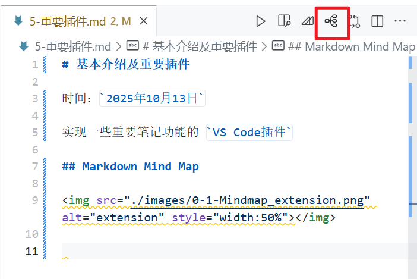
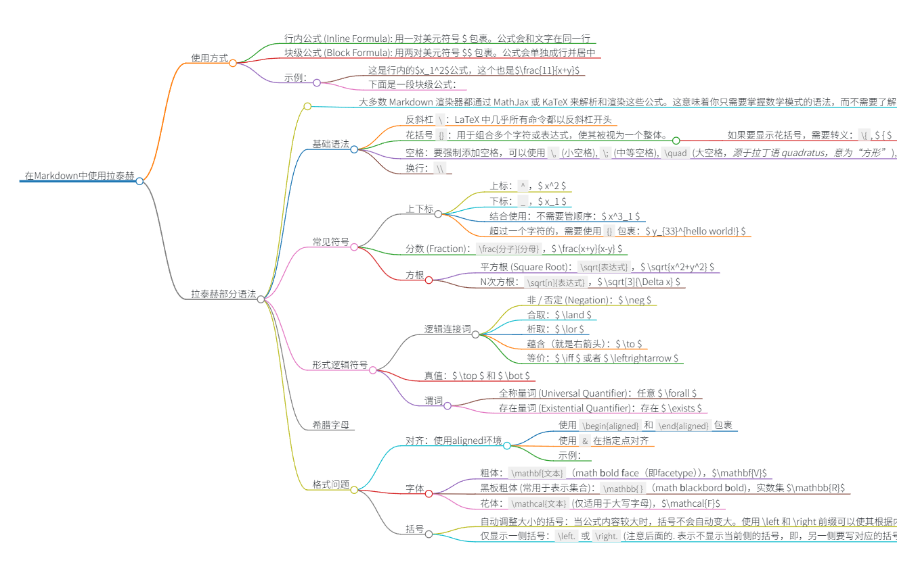
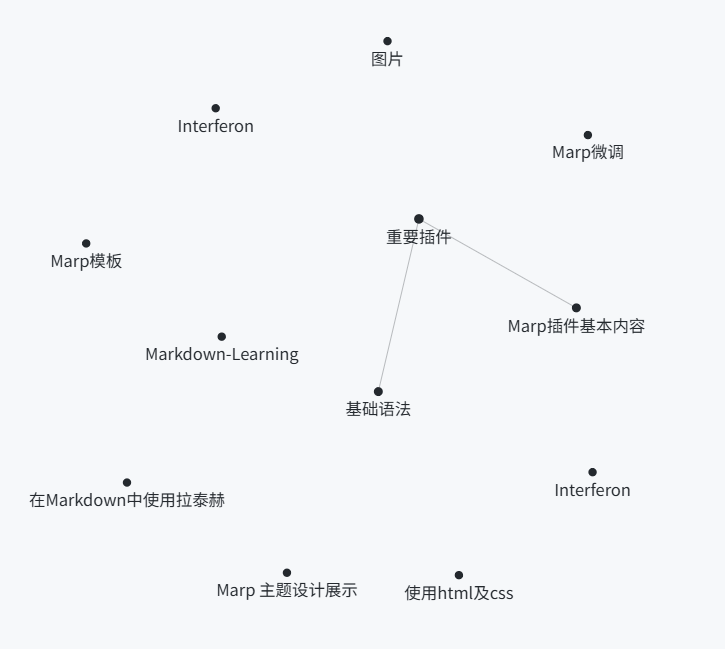

# 重要插件

时间：`2025年10月13日`

- 实现一些重要笔记功能的 `VS Code插件`
- 注意：安装拓展后如果无法使用，记得重启VS Code

## 基础插件

- Markdown Notes Pack：包含了 Markdown Preview Enhanced
- Markdown PDF

## Markdown Mind Map

</img>

- 可以将markdown一键转化为mindmap
  - 缺点是有些语法无法渲染、无法编辑或导出成图片，只能截图
  - 适合预览当前结构
- 使用方式及结果
  - 点击右上角图标预览： </img>
  - 结果： </img>

## Mermaid Preview

</img>

- 支持mermaid代码的预览

## Foam

</img>

- 实现 **关系图谱（Graph View）** 功能
- 可以在左下角看到当前的关联节点（ALL LINKS）及其方向，以及孤儿节点（Orphan Node）
  - 在编写 Markdown 时，可能会创建一个指向**尚未存在的文件**的链接，例如这么一句话：`我之后要去研究一下 Interferon 这个概念`
  - 当 `Interferon` 出现了很多次时，即使 `Interferon.md` 这个文件根本不存在于文件夹里，Foam 也会识别到这个链接意图。它会在关系图谱中创建一个“虚拟”的节点，这个节点被称为**占位符笔记（Placeholder Notes）** 或**孤儿节点 (Orphan Node)**
  - 这样做的好处是：可以提醒使用者下一步的目标和方向
- 查看关系图谱：
  - 打开命令面板（`Ctrl+Shift+P`）
  - 输入并选择 `Markdown Links: Show graph`
  - 如下： </img>

## Marp

</img>

- 快速转成Slides
- **注意**：同样不要使用 `MPE` 打开
- 使用详见[3.1-Marp插件基本内容](./6-Marp/3.1-Marp插件基本内容.md)