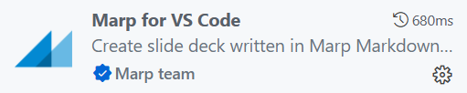

# 重要插件

#Markdown插件

时间：`2025年10月13日`

- 实现一些重要笔记功能的 `VS Code插件`
- 注意：安装拓展后如果无法使用，记得重启VS Code

## 基础插件

- `Markdown Notes Pack`：包含了 `Markdown Preview Enhanced`、`Markdown all in one` 等插件
- `Markdown PDF`

---

## Markdown Mind Map

- 可以将markdown一键转化为mindmap
  - 缺点是有些语法无法渲染、无法编辑或导出成图片，只能截图
  - 适合预览当前结构
- 使用方式及结果
  - 点击右上角图标预览： 
  - 结果： 

## Mermaid Preview

- 支持mermaid代码的修改

- 支持原生 markdown 渲染器中 mermaid 的渲染

---

## Foam

### 1. 关系图谱

- 实现 **关系图谱（Graph View）** 功能
- 语法：
  - 对于 `.md` 文件：同[文件间转跳](./1-基础语法.md#文件间转跳)
  - 对于非 `.md` 文件：使用Foam的语法 `[[目标文件名]]`；例如[[Test.py]]，注意，这个不能实现转跳，但是在关系图谱中可见  
- 可以在左下角看到当前的关联节点（ALL LINKS）及其方向，以及孤儿节点（Orphan Node，与其他笔记没有任何联系的笔记）
- 占位符 
  - 在编写 Markdown 时，可能会创建一个指向**尚未存在的文件**的链接，例如这么一句话：`我之后要去研究一下 Interferon 这个概念`
  - 当 `Interferon` 出现了很多次时，即使 `Interferon.md` 这个文件根本不存在于文件夹里，Foam 也会识别到这个链接意图。它会在关系图谱中创建一个“虚拟”的节点，这个节点被称为**占位符（Placeholder）** 
  - 这样做的好处是：可以提醒使用者下一步的目标和方向
- 查看关系图谱：
  - 打开命令面板（`Ctrl+Shift+P`）
  - 输入并选择 `Markdown Links: Show graph`
  - 如下： 
    - （可以拖动节点）

### 2. 打Tag

- 语法：` #tag `，注意，`#` 后不加空格，前后需要空格
- 示例：
  - √: #Test_tag 
  - ×：#test-tag
- 结果：在 `Tag explorer` 中查看 
  -  

---

## Material Icon Theme

- 将 VS Code 文件浏览器中默认的、单调的文件和文件夹图标，替换为一套基于 Google Material Design 设计语言的、色彩丰富且辨识度极高的图标库
  - 提升文件辨识度
  - 可定制性
- 图标详见[该项目Github库的README文件](https://github.com/Jonathan-Harty/vscode-material-icon-theme)，以下是节选 
- 自定义外观：`Ctrl+Shift+P`
  - 修改颜色：→ `Material Icons: Change Folder Color`
  - 开关包：→ `Material Icons: Change Folder Color`

---

## File Tree Generator

- 生成文件夹结构树
- 使用方法：右键目标文件夹 → `Generate to tree`

---

## Table formatter

- 格式化表格
- 使用方法：`Ctrl + Shift + P`
  - → `Table: Format Current`
  - → `Table: Format All`

---

## Marp

- 快速转成Slides
- **注意**：同样不要使用 `MPE` 打开
- 使用详见[3.1-Marp插件基本内容](6-Marp/6.1-Marp指令.md)