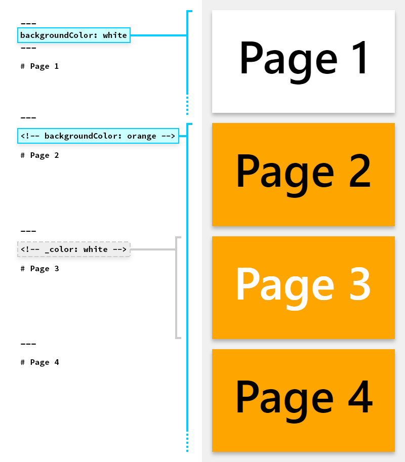

# <!-- fit --> Marp 指令

时间：`2025年10月25日`

---

## 0. 基本操作

- 分页方式：使用 `---` 分页
  - 需要自行分页
- 封面标题
  - 使用 `# <!-- fit --> ` 后接文字来使文字适应大小
  - 示例见封面页

---

## 1. 指令

Marp 使用的语法被称为 “Directives（指令）”；符合 `YAML 语法`

- **Global Directives**：应用于整个幻灯片文档；在文档**头文件**中定义
- **Local Directives**：应用于部分幻灯片；使用 HTML 注释语法 `<!-- content -->` 在目标幻灯片内容前定义

---

## 2. Global Directives

- 如果有多次赋值的话，最终的效果是最后的赋值
- 语法：头文件，使用 `---` 包裹，写在文档开头
  - 加上头文件才能在预览中开启 Marp
  - 注意：**头文件要顶着第一行写！**
  - 不使用 `MEP`

---

- 示例：

  ```markdown
  ---
  marp: true
  theme: gaia
  size: 16:9
  ---
  ```

---

### 2.1 `theme`

- `theme`：指定主题
- Marp 只有三个自带主题：`default`、`gaia`、`uncover`

---

### 2.2 `style`

- `style`：用于添加自定义的 CSS 样式
- 语法：

  ```
  ---
  style: |    /* 这是一个 YAML 多行字符串的写法 */
    h1 {
      color: #4A90E2; /* 将所有一级标题颜色设为蓝色 */
    }
    section {
      background-color: #f8f8f8; /* 设置每张幻灯片的背景色 */
    }
  ---
  ```

---

## 3. Local Directives

两种语法：

- 定义接下来的所有页面：`<!-- backgroundColor: aqua -->`
- 只定义当前页面：`<!-- _backgroundColor: aqua -->`
  - （Add underscore prefix `_` to the name of local directives）

---



---

### 参数详解

- `class`: 为当前幻灯片的 `<section>` 元素指定一个 HTML 类名
  - 语法：`class: 类名`
  - 使用 css 定义样式
- `paginate`: 控制是否在当前幻灯片显示页码。`true` / `false`
  - *可以用于头文件*

---

- `header`: 指定当前幻灯片的页眉内容
  - *可以用于头文件*
  - 支持 Markdown 语法，如加粗 (`**bold**`)、斜体 (`*italic*`) 和内联图片 `(`）；也支持使用 `` 标签插入图片
- `footer`: 指定当前幻灯片的页脚内容
  - *可以用于头文件*
  - 同上第二点

---

- `backgroundColor`: 设置当前幻灯片的背景颜色；使用颜色名称或十六进制颜色码
  - 语法：`<!-- _backgroundColor: black -->`
- `backgroundImage`: 设置当前幻灯片的背景图片
  - 语法-设置渐变：`<!-- backgroundImage: "linear-gradient(to bottom, #67b8e3, #0288d1)" -->`
  - 语法-设置背景图：`<!-- backgroundImage: "url('链接')" -->`
- `color`: 设置幻灯片上文字的颜色
  - 语法：`<!-- _color: white -->`


---

## 4. 导出

- 点击 marp 的图标，选择 `Export Slide Deck`
- 有几种可选格式
- 注意：导出后的PPT是**纯图填充背景**，不能修改

---

## 5. 相关链接

- Github仓库地址
  - https://github.com/marp-team/marp
  - https://github.com/marp-team/marp-vscode
- 官网：https://marp.app/
- 官方语法文档：https://marpit.marp.app/markdown
